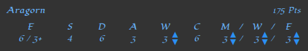
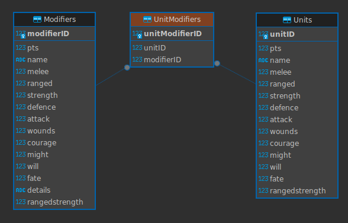

# miniature-muster
For organizing character sheets and providing combat outcomes for the LOTR tabletop game.


## Installation

> I'm currently running this at https://lotr.timsullivan.online. Feel free to use it there, instead of installing locally! No promises that I'll keep that domain in the future :sweat_smile:
> If you want to make changes to the unit or equipment lists, you'll need to install your own copy.

Installation requires three steps:

1. Get the code
2. Define an env file
3. Docker build & run

### (1) Get the code

First, get a copy of the repo

```bash
# First, clone the repo
git clone https://github.com/TimboInSpace/miniature-muster.git
cd miniature-muster

```


### (2) Define an env file

Write a `.env` file into the `miniature-muster` directory. Most importantly, the `.env` file contains a reference to the URI of the application when it's hosted - this is only important for functionality of the *SHARE* button. The file should have this format:

```
PORT=3000
#HOST_URI=https://YOUR.DOMAIN.HERE
HOST_URI=http://localhost:3000
DB_TYPE=json
```

> Replace `YOUR.DOMAIN.HERE` with the address of your website, or leave the file as-is to just run it locally.


### (3) Docker build & run

Build the docker container and run it

```bash
docker build -t miniature-muster .
docker run --rm -it -p 3000:3000 miniature-muster:latest
```

> To stop the container, you can just use `Ctrl+C`


## Usage

Open your web browser and navigate to where it's running. If you're running it locally, it will be on http://localhost:3000. Follow the prompts and go through the three steps of the application. Steps 1 and 2 are for setting up a battle, and Step 3 is used during the battle.

### Step 1 - Define players

Input your names. Write a name and hit `Enter` or click the *ADD* button. Add one entry for each person playing, even if they're on the same team. 

> If someone "controls" units, they are a player.

Click *CONTINUE* when to proceed.

### Step 2 - Define Armies

##### Choose a unit

This page is split into two panes: the righthand pane displays the army for each player (split into tabs); the lefthand pane is for choosing units to add into the army.

Use the search feature above the unit selection box to search for the name of your desired unit. This simply filters the selection box according to unit names. After locating the desired unit, click on its name; the unit's stats and potential equipment will appear below the unit selection box.

##### Add equipment

Add equipment to the unit. Some equipment (ex. armor) will change the unit's stats automatically, some only affect points, and some are for recordkeeping only. Just click the equipment to add it to the unit. The equipment is selected if the checkbox on the button is checked.

> Note that there is a UI bug here - sometimes you'll need to click the text on the equipment button.

##### Choose Player and quantity

Use the dropdown selection to choose which player's army this unit should join. Choose a quantity of this unit to add to the army - you'll see the subtotal for *points* updated below.

Finally, **click the *RECRUIT* button** to add the unit group to the selected player's army.

> If you made a mistake while adding units to an army, no problem! 
> Just click the little *X* button in the top-right of the unit's entry in the righthand pane.

Keep choosing units until each player's army is complete. You can see each army's point totals by switching between tabs of the righthand pane.

Click *CONTINUE* to proceed.

### Step 3 - Battle!

This step is to be used while playing the match, for showing combat outcomes. Select one unit on the lefthand pane and one unit on the righthand pane to see the combat outcomes for a fight between those two units.

Step 3 shows two functionally-identical panes on the left and right, listing units in each army:


:crossed_swords::shield: **The sword and shield button is toggleable**. When the sword is on the left / shield on the right, the unit on the lefthand pane is the attacker and the unit on the righthand pane is the defender. Click the button to easily reverse these roles.

Step 3 also shows a pane at the bottom for displaying combat outcomes:


:bow_and_arrow: To see the outcome from a ranged shot, make sure that the shooting unit is selected as the attacker, and the shot unit is selected as the defender.

This step is also useful for recordkeeping during the match. The *wounds* stat and *might / will / fate* can freely be increased or decreased by clicking the little buttons next to those stats in the unit's stat display:




## Sharing

At any point after Step 1, you can click the *SHARE* button to create a sharable link. This wraps up the whole application state into a link. It's useful for a variety of scenarios:

- Sending a link to the match so your friends can open it
- Opening the same game in another browser. 
  For example, sometimes I like to do Steps 1 and 2 on my laptop, then use my tablet for Step 3 (during play).
- "Saving" the setup of a certain battle that you might want to re-play.
- Archiving the current state of a match, if you need to pack up for the day and pick this match up again later.

> <u>Note:</u> The state of the application is saved into your browser cookie after almost every action. **Using the *SHARE* button is only necessary for moving between browsers, or persisting after you clear your cookies** :cookie:


## Defining new units / equipment

When I made this application, I wrote stat sheets for all units up to and including the Two Towers edition of the game, plus some extra units that I had on-hand. You may find this selection lacks a unit you need. No problem: they're easy to define!

#### Database modifications

First, you'll need to add the unit into the database: open up `database.sqlite` in your favourite database program, or just use `sqlite3` if you're hardcore. Any database program that can interface with SQLite will work. One suggestion I have is `DBeaver` but use whatever.



##### (1) Define equipment

First, add any equipment that your unit might need (**but only if it isn't defined already!)** into the Modifiers table. Each piece of equipment has a whole stats sheet and a point cost. The text that appears next to equipment in Steps 2 and 3 is recorded into "details".

> Note that RangedStrength is the strength of the ranged capability of the unit. It is *generally* recorded on the bow/crossbow/etc, *not on the unit*.
>
> The exceptions to this are units that do not require equipment to have ranged capabilities. For example, **Rider of Rohan** and **Legolas** each have inherent ranged capabilities and do not need to be explicitly equipped a bow to use them.

Then, jot down the modifierID of any equipment you might need for your unit. You'll need these indices in a minute.

##### (2) Define the unit

Create a stats sheet for the unit. It's fine if it's custom / made up. If it's a regular model, copy the stats from the rule book. If you define a new unit, jot down it's unitID.

> :rainbow: For example, I made a Unicorn unit. 
> It's a Rohan horse model, but added a horn to it and painted it all sparkly. It's unmountable but has substantial spells and an incredible Fate stat.

##### (3) Associate equipment with the unit

Next, we need to define what equipment (modifiers) are applicable to the unit. This isn't default equipment: it's the set of equipment that the unit may choose for their loadout.

For each piece of equipment that a unit may use, you'll need to add a row to the UnitModifiers table. Just record the unitID and modifierID in the row. 

#### Exporting the database

After you've made modifications to `database.sqlite`, it's really easy to export it into the web app. I wrote a script that exports everything automatically, you just need to run it. (You'll need `NodeJS` and `NPM`)

From the project directory, simply enter this command:

```bash
npm run export-json
```

And that's it! Just restart the docker container and you're good to go :thumbsup:


## Disclaimer

There is a known issue where, on Step 2, clicking on equipment doesn't properly bubble the Click event up to the right element. It should work fine if you click on the text part of the button instead.

I made this application for my own personal use. I didn't really put a lot of effort into compatability. If it doesn't look nice in your browser... :man_shrugging:


## To Do

- [ ] Fix the Click event bug shown in [Disclaimer](#Disclaimer).
- [ ] On the Step 3 page, there should be a small icon on the unit indicating special equipment, or maybe just whether or not the unit is ranged. This could take the form of a tiny icon in the corner of the unit, or maybe a blurred/darkened icon underneath the unit text?
- [ ] Add **spells** to units. You should be able to click on a unit in the Step 3 page and see what spells it has, with a short summary of each. 


---


Tabletop strategy games are super geeky, but actually really fun. I hope many people find this application useful. Please :star: this repo if you're enjoying it!
